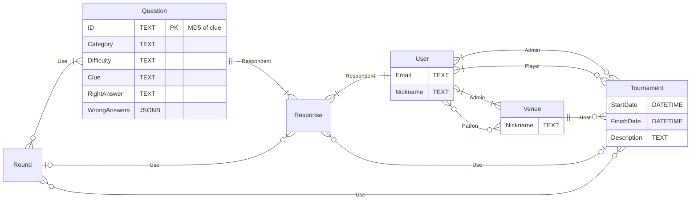

# README

## The plan, I hope

### Start from your Goal

#### Why am I making this project?

Hobby/customer/portfolio

#### Who is this project for?

#### What is going to make it valuable?

### User Stores

1. Simple, short, user’s perspective. User centric. How does the app works for them.
2. 10-20 stories, perhaps

#### Users can log in with basic auth

Maybe later upgrade this to something realistic.

#### Users can join a Tournament

#### Users can see clues and answers, and choose an answer

#### All user history is recorded

For analysis, team, scoring

### Define your data models

#### What to store

All have timestamps


##### Entities

```mermaid
  info
```



#### How it relates

#### How it is queried / used

### Nail an MVP

Remove non-minimally viable stuff. Build the smallest things you can.

### Wire frame, simple UI, nav, and flow prototype

Stick figures, boxes, arrows

### Understand what the future of the project will look like

Will need to scale? Week end? Throw away?

### Drill in to essential components

* UI?
* Script?
* BE?
* FE?
* Browser Extension?
* …

### Pick the (simplest) stack

How/where to deploy? What is the deployment path/steps?

### Overall dev process

* Create project skeleton
  * Basic folder structure (NPM mono repo, for example)
  * Development environments
  * Version control
* Set up database and create data models
* Build the backend routes
  * API endpoints
* Frontend interface

---

## Trivia-Together

### Features

* phone app (initially a web app)
* TV app (again, a web app)
* count-down timer for phone app
* QR code for TV app
* pull a list of cities-- game is to guess the states. Only use cities that are uniquely named across states-- or in advanced-mode, be sure that the State answer options are such that there IS NOT a same named city in any option but the correct one
* user accounts, track usage, points/wins
* location accounts, users are always at a location.
* potential answers are only visible on the TV app (at that location).
* phone app has the question, a grid to chose an answer, but the answers are not shown (only A/B/C/D)
* John in-between questions only
* dashboards per bar and nationwide
* give players intelligence in how they're ranking
* track trivia categories past abd upcoming
* [Open Trivia Database](https://opentdb.com/) [example](https://opentdb.com/api.php?amount=10&category=15&difficulty=easy&type=multiple)
* I"m adding the MapBox Trivia idea to this project, mostly to keep count of loose-threads low.

### MapBox Trivia Idea

* A question whose answer is a map location/state/city/POI/etc.
* An ever zooming in map that slowly eliminates the wrong answers. The 'center' of the zooming needs to be erratic/randomized to prevent making the correct answer obvious. Or, perhaps a concentric, tightening spiral that is also randomized. Nothing too dizzying.

### Other factors

* Implement a version with HTTP/REST and another using SignalR, Go Channels, and WebSockets. So independent implementations in .NET. Go-lang, Java (perhaps with and without SpringBoot), JavaScript.
* build a TDD version of the logic, then add (SI, DB, UI, etc) stuff in. PD-first
* how should the PD handle the realtime updates w/testing? A: channels/messaging w/ interrupts/event-handlers?
* deal with critical timing, like the last few seconds (never mind the whole duration) of a question. Same with the time-until-next-question/round tracking.
* maybe use a 'diary' over, say, a BullMQ/Agenda.js sort of solution (at the PD-level). Hmmm. 
* play the re=joinable music! make the probable, at the PD-level, all about a script. the system (servers, clients) must be able to safely and correctly re-join the script (already in-progress) as needed. TDD should use this, including injecting dis-/re-connect scenarios.

### Phases

I need to find a way to `mmd` a cycle/circular graphic. The cycle in question would be:

1. assemble
2. play
3. archive

Maybe concentric rings?

Actually, this is probably a timeline. Hmm. About that.
